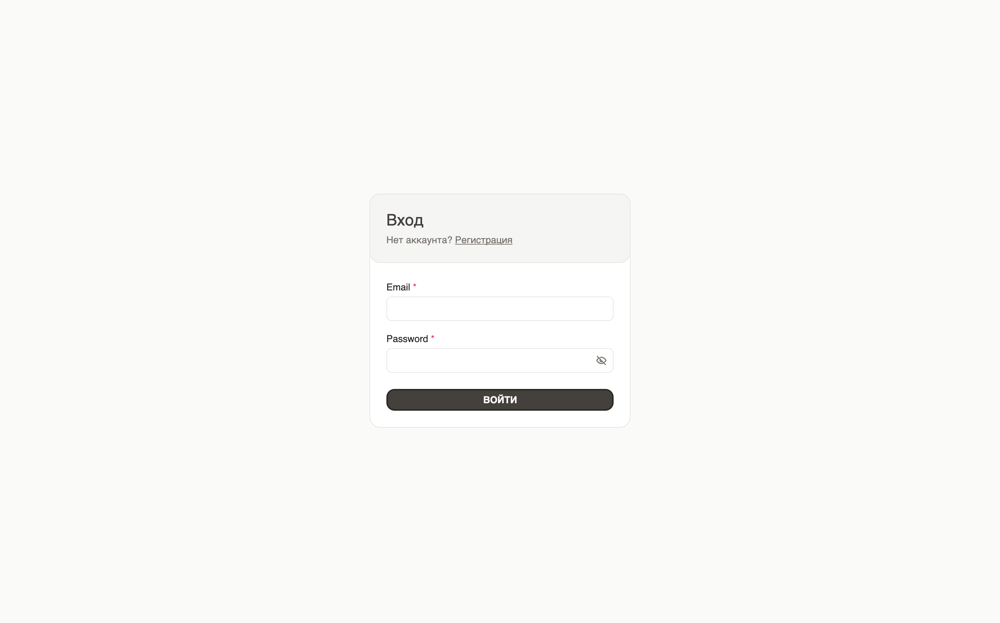
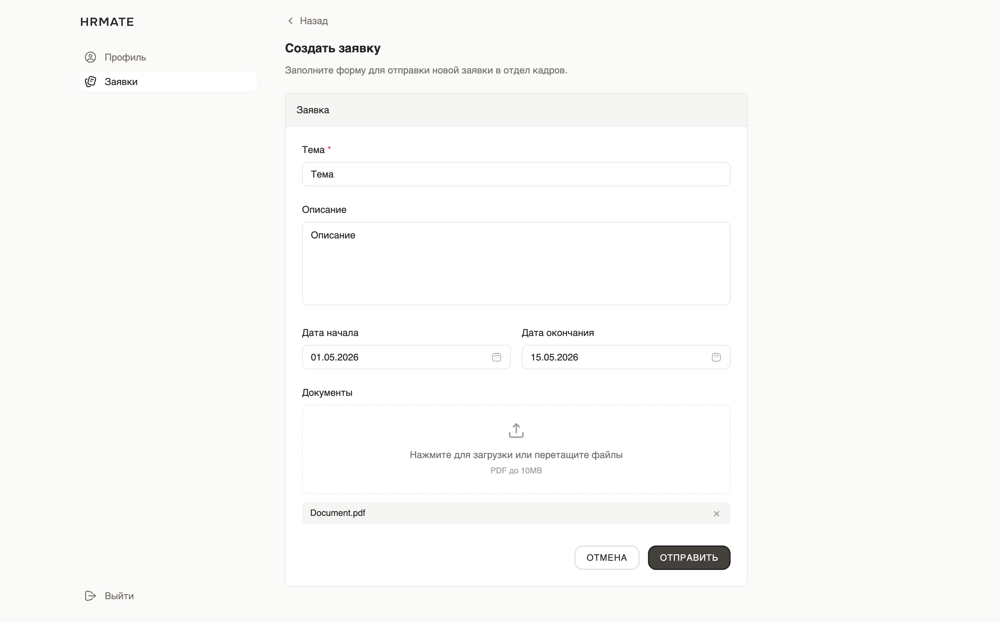
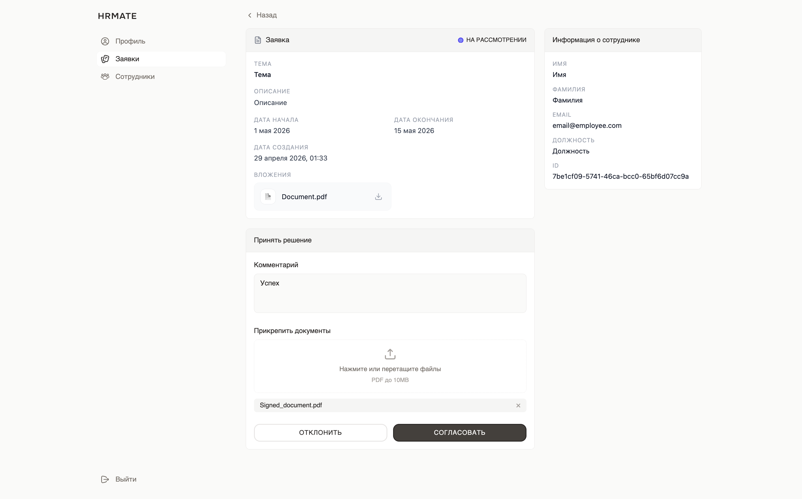
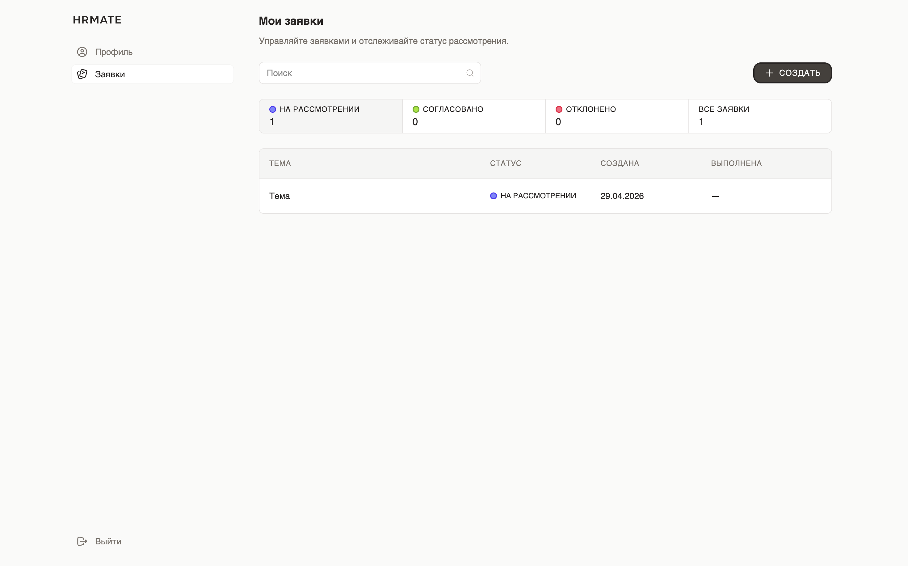
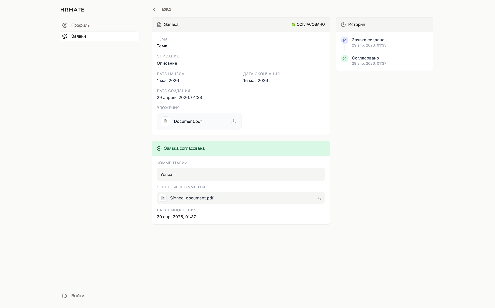
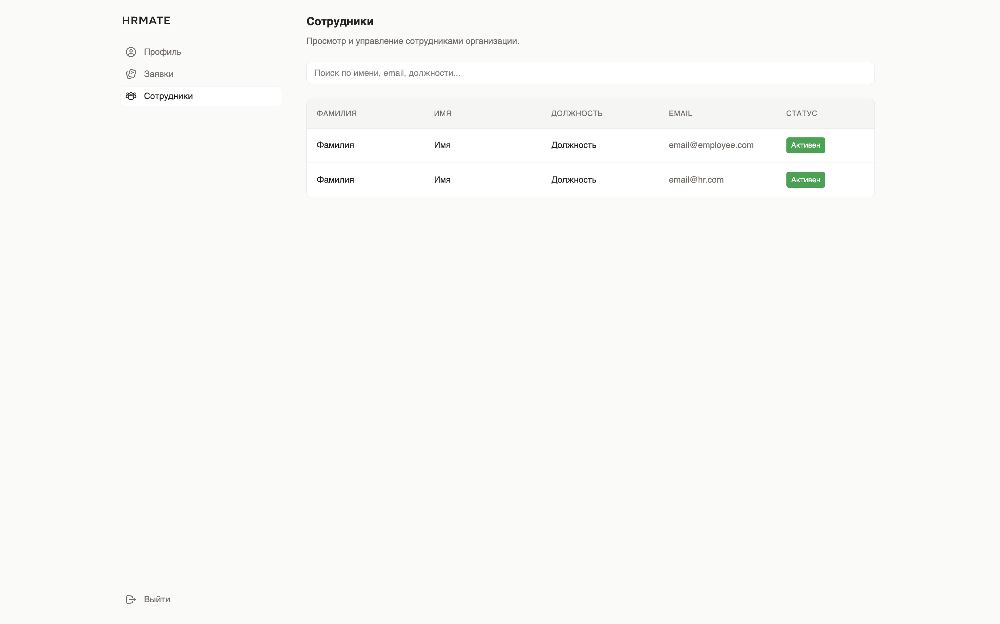

# HRMate Web

> Веб-интерфейс HR Mate на React

<p align="center">
  <a href="#"></a>
  <a href="#"></a>
  <a href="#"></a>
  <a href="#"></a>
  <a href="#"></a>
</p>

## Оглавление

- [Описание](#описание)
- [Технологии](#технологии)
- [Функционал](#функционал)
- [Конфигурация](#конфигурация)
- [Быстрый старт](#быстрый-старт)
- [Структура проекта](#структура-проекта)
- [Разработка](#разработка)
- [Лицензия](#лицензия)


## Описание

**HRMate Web** — это современное React-приложение, предоставляющее интуитивный веб-интерфейс для системы управления персоналом. Построен с акцентом на производительность и удобство разработки, предлагая адаптивную панель управления с разграничением прав для сотрудников, HR-специалистов и администраторов.

**Ключевые особенности:**
- **Современный UI/UX** — Построен на компонентах shadcn/ui и Tailwind CSS
- **Безопасная разработка** — Полная поддержка TypeScript
- **Управление видами** — Кастомная система роутинга на основе состояния
- **JWT-аутентификация** — Безопасная авторизация с сохранением токенов
- **Загрузка файлов Drag & Drop** — Удобное управление документами

## 📸 Скриншоты

<div align="center">

**Авторизация**



**Создание заявки (сотрудник)**



**Рассмотрение заявок (hr)**



**Отслеживание заявок (сотрудник)**



**Решение по заявке (сотрудник)**



**Управление пользователями (admin)**



</div>

## Технологии

| Component            | Technology      | Version |
| -------------------- | --------------- | ------- |
| **Framework**        | React           | 18.3.1  |
| **Build Tool**       | Vite            | 6.3.5   |
| **Language**         | TypeScript      | 5.x     |
| **Styling**          | Tailwind CSS    | 4.1.12  |
| **UI Components**    | shadcn/ui       | Latest  |
| **HTTP Client**      | Axios           | 1.15.2  |
| **State Management** | React Context   | 18.x    |
| **Animation**        | Motion          | 12.x    |
| **Icons**            | Lucide React    | 0.487.0 |
| **Forms**            | React Hook Form | 7.55.0  |
| **Notifications**    | Sonner          | 2.0.3   |


## Функционал

### Аутентификация и авторизация

- ✅ JWT-based authentication с localStorage
- ✅ Автоматический logout при 401 ошибке
- ✅ Регистрация новых пользователей (employee, hr)
- ✅ Сохранение сессии между перезагрузками

### Управление заявками

- ✅ Создание заявок сотрудниками
- ✅ Прикрепление документов к заявкам (drag & drop)
- ✅ Просмотр списка заявок с фильтрацией
- ✅ Согласование/отклонение заявок HR-специалистами
- ✅ Добавление комментариев и документов к решениям
- ✅ Удаление заявок (admin)

### Управление пользователями

- ✅ Просмотр профиля текущего пользователя
- ✅ Список всех пользователей (hr, admin)
- ✅ Активация/деактивация пользователей (admin)
- ✅ Разграничение прав доступа по ролям

### Компоненты UI

- ✅ 50+ готовых компонентов shadcn/ui
- ✅ Темная/светлая тема
- ✅ Адаптивная боковая панель навигации
- ✅ Таблицы с сортировкой и пагинацией
- ✅ Модальные окна и диалоги
- ✅ Уведомления (toast)
- ✅ Drag & Drop для загрузки файлов


## Конфигурация

### Nginx Config (Docker/Production)

Проксирование API для обхода CORS в продакшене настроено в `nginx.conf`:

```conf
    location /api/ {
        client_max_body_size 100M;      # Максимальный размер тела запроса

        proxy_pass http://api:8080/;    # Проксирование на бэкенд
        proxy_http_version 1.1;
        proxy_set_header Host $host;
        proxy_set_header X-Real-IP $remote_addr;
        proxy_set_header X-Forwarded-For $proxy_add_x_forwarded_for;
        proxy_set_header X-Forwarded-Proto $scheme;
    }
```

## Быстрый старт

1. **Клонирование репозитория**

```bash
git clone https://github.com/platonso/hrmate-web.git
cd hrmate-web
```

1. **Запуск всех сервисов**

```bash
make up # http://localhost:3000
```


## Разработка

### NPM Scripts

```bash
# Разработка
npm run dev              # Запуск dev-сервера Vite

# Сборка
npm run build            # Production сборка в dist/
```


### Команды Makefile

```bash
# Запуск контейнера
make up

# Просмотр логов
make logs

# Остановка и удаление контейнеров
make clean
```
